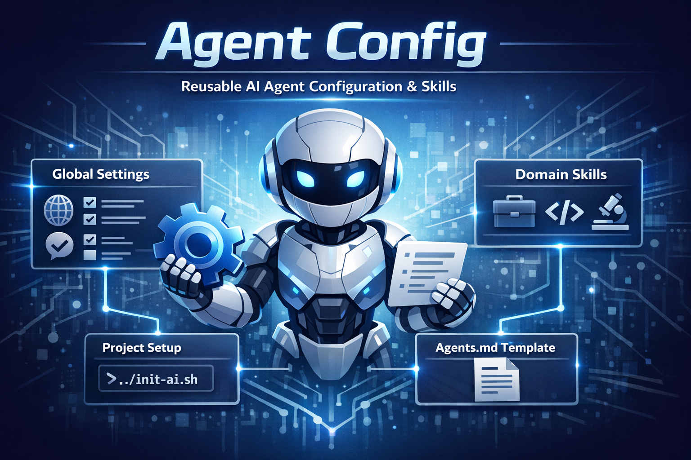

# Agent Config 🛠️



This repository contains reusable AI agent configuration and skills. It is designed to be cloned into a new project to give an AI agent instant context, global preferences, and domain-specific skills.

## How to Install

The recommended approach is to add this repository as a git submodule named `.agent` in your new project:

```bash
cd my-new-project
git submodule add https://github.com/paulopezgil/agent-config .agent
```

This keeps your agent configuration version-controlled and easily updatable across projects.

## Initialization

After adding the submodule, run the initialization script from your project root:

```bash
./.agent/scripts/init-ai.sh
```

This script will ask for your project name and language, and copy the `AGENTS.md` template into your project root. You can then fill in the project-specific details to guide your AI agent.
